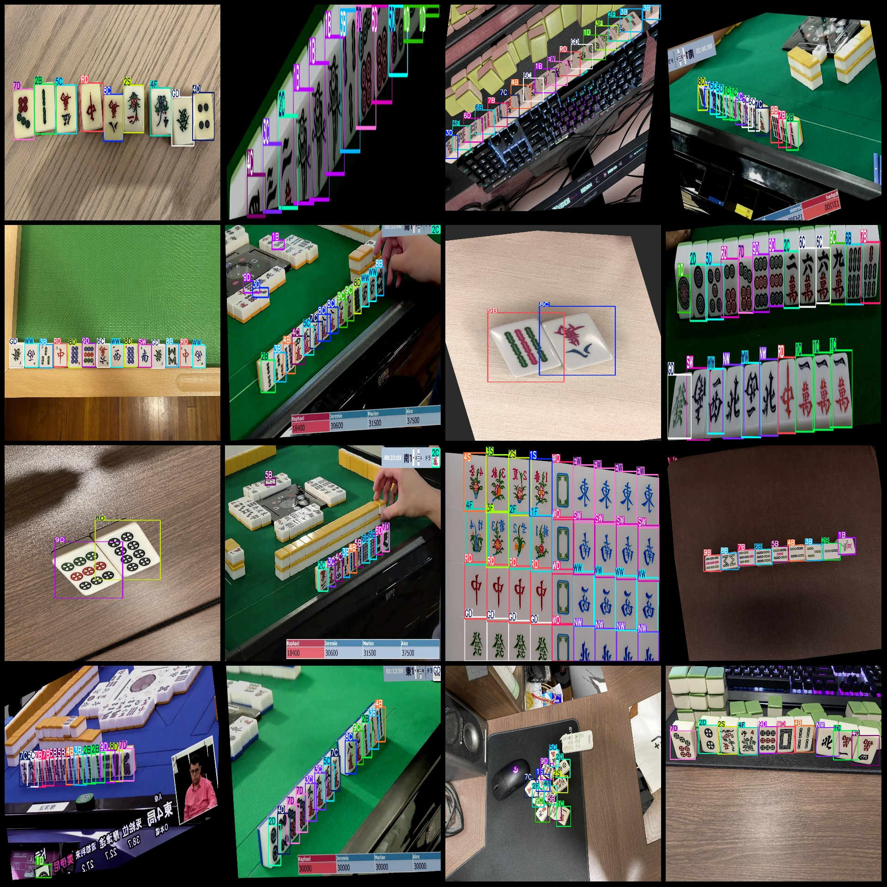
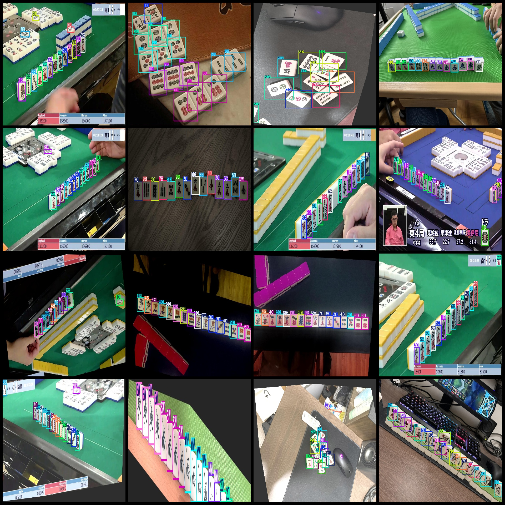

# Mahjong Detection Dataset VOC+YOLO with 7643 Images and 42 Categories

```

Dataset format: Pascal VOC format + YOLO format (txt file without split path, only containing jpg images and corresponding VOC format xml files and yolo format txt files)

Number of images (number of jpg files): 7643
Number of xml files: 7643
7643
Labeled category count: 42
The annotation class names are: ["1B", "1C", "1D", "1F", "1S", "2B", "2C", "2D", "2F", "2S", "3B", "3C", "3D", "3F", "3S", "4B", "4C", "4D", "4F", "4S", "5B", "5C", "5D", "6B", "6C", "6D", "7B", "7C", "7D"]
"8B","8C","8D","9B","9C","9D","EW","GD","NW","RD","SW","WD","WW"]  
boxes per class:   
1 Byte of data = 3050 frames
1C box count = 3507  
1D box count = 3240  
1F box count = 1202  
1S frame count = 1154
2B box count = 3380  
2Cbox count = 3147
2D Frame Count = 3201
2F box count = 1110  
2S box count = 1078  
3B box count = 2978  
3C box count = 3242  
3D box count = 3329  
3F box count = 1151  
3S box count = 1154  
4B box count = 3051  
4C box count = 3182
4D Frame Count = 3364
4F box count = 1065
4S box count = 1090  
5B box count = 2873  
5C box count = 3279  
5D box count = 3354  
6B frames = 3138
"6C box count = 3302" can be translated to:

"The number of 6C frames is 3302."
6D Frames = 3239
$7B$ box count = $3043$
7D box count = 3156  
8B box count = 2719  
8C box count = 3696  
46
9B box count = 3237  
9C box count = 3169  
9D box count = 3017  
EW Frames = 3035
"GD box count = 3207" is a simple sentence in Chinese. The English translation would be:

"The number of GD frames is 3207."
NW box count = 3054  
RD box count = 3168  
SW box count = 2750  
WD box count = 2699  
WW box count = 2917
```
## Images





Here is a pay link on Stripe ( https://buy.stripe.com/3cs8yP7sY87d0vu9AB ). Please contact me lonlonago@foxmail.com after funding $89, and I will send you a complete data files , thank you!


